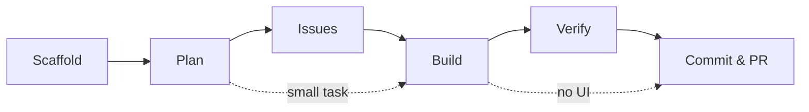

# dotfiles

> Agent-first Cloudflare development on macOS.
> **Stack:** Ghostty + Starship + Claude Code + Wrangler + NVM + uv + Colima/Docker + lazygit

[](LICENSE-MIT.txt)

## Install

```bash
git clone https://github.com/jamesfdavis/dotfiles.git ~/dotfiles
cd ~/dotfiles && ./install.sh
```

Five steps run automatically:
1. **Homebrew** -- installs all packages from `Brewfile`
2. **Symlinks** -- dotfiles and `~/.config` directories
3. **SSH keys** -- generates auth + signing key pair, configures macOS Keychain persistence
4. **Node.js** -- installs LTS via NVM
5. **npm globals** -- installs `claude-code` and `wrangler`

## What gets installed

| Category | Packages |
|----------|----------|
| **Terminal** | Ghostty, Starship, zsh-autosuggestions, zsh-syntax-highlighting, zsh-history-substring-search, Fira Code Nerd Font |
| **Agent** | Claude Code (npm global) |
| **Platform** | Wrangler (npm global) |
| **Node.js** | NVM (with .nvmrc auto-switching) |
| **Python** | python@3.12, uv (fast package manager) |
| **Git** | git, gh, lazygit |
| **Containers** | Colima, Docker, Docker Compose |
| **CLI** | ripgrep, fd, fzf, jq, bat, eza, zoxide |
| **Editors** | Neovim (terminal, with telescope + treesitter), VS Code (review) |

## File structure

```
dotfiles/
├── install.sh              # Main entry point (5 steps)
├── bootstrap.sh            # Symlinks everything
├── Brewfile                # Homebrew packages
│
├── config/
│   ├── ghostty/config      # Terminal config  -> ~/.config/ghostty/
│   ├── starship.toml       # Prompt config    -> ~/.config/starship.toml
│   └── nvim/init.lua       # Neovim config    -> ~/.config/nvim/
│
├── scripts/
│   ├── setup-homebrew.sh   # Brew + bundle
│   └── setup-ssh-signing.sh# SSH keys + Keychain persistence
│
├── obsidian/               # Developer workflow docs (open as Obsidian vault)
│   ├── 00-stack.md         # Tool stack overview
│   ├── 01-ghostty-starship.md
│   ├── 02-claude-code.md
│   ├── 03-cloudflare.md
│   ├── 04-docker.md
│   ├── 05-git-workflow.md
│   ├── 06-python-uv.md
│   ├── 07-neovim.md
│   ├── 08-fzf-ripgrep-fd.md
│   ├── 09-cli-utilities.md
│   ├── 10-node-nvm.md
│   ├── 11-lazygit.md
│   ├── 12-github-cli.md
│   └── 13-zsh-shell.md
│
├── docs/
│   └── KEYS.md             # SSH key docs
│
├── .zshrc                  # Shell config (NVM lazy load, zoxide, no Oh My Zsh)
├── .aliases                # All shell aliases
├── .exports                # Environment variables
├── .functions              # Shell functions
├── .gitconfig              # Git settings + SSH signing + commit template
├── .gitmessage             # Git commit template (opens in nvim)
├── .gitignore              # Global ignores (OS, editor, secrets)
├── .gitattributes          # Line ending normalization
├── .editorconfig           # Indent style (2 spaces JS/TS, 4 spaces Python)
├── .inputrc                # Readline config (python REPL, etc.)
├── .ripgreprc              # ripgrep defaults
└── .extra.example          # Template for secrets
```

## Developer Workflow


```mermaid
graph LR
    S["Scaffold"] --> P["Plan"]
    P --> I["Issues"]
    I --> B["Build"]
    B --> V["Verify"]
    V --> C["Commit & PR"]

    P -.->|small task| B
    B -.->|no UI| C
```

| Phase | Purpose |
|-------|---------|
| Scaffold | Generate a new SvelteKit PWA + Cloudflare project |
| Plan | Research codebase, evaluate Svelte 5 / Workers / PWA constraints, draft design |
| Issues | Break plan into sized, ordered GitHub issues with dependency links |
| Build | Layered TDD: unit (vitest) → component (testing-library) → E2E (playwright/browser) |
| Verify | Browser-based UI verification via `claude --chrome` |

## Key aliases

```bash
# Claude Code
cc / ccc / ccr / cci        # claude / chat / resume / init

# Cloudflare
wr / wrd / wrp / wrl        # wrangler / dev / deploy / tail
wrd1 / wrkv / wrr2          # d1 / kv / r2

# Git
lg                          # lazygit
gs / ga / gcm / gp / gl     # status / add / commit / push / pull
glog / uncommit             # log graph / undo last commit

# GitHub
ghpr / ghprw / ghprc        # pr create / view web / checkout

# Python / uv
uvv / uva / uvd             # venv create / activate / deactivate
uvi / uvir                  # pip install / install -r requirements.txt
jn / jl                     # jupyter notebook / lab

# Docker
dc / dcu / dcd / dcl        # compose / up / down / logs

# Navigation
z <dir>                     # smart directory jump (zoxide)

# Editors
v / c / c.                  # nvim / code / code .
```

## Neovim

Neovim is configured for fast edits and git commit authoring:
- **Telescope** -- `<leader>f` find files, `<leader>g` live grep, `<leader>b` buffers
- **Treesitter** -- syntax highlighting for JS/TS/Python/Lua/Bash/etc.
- **Catppuccin Mocha** -- matches Ghostty theme
- **Git commits** -- `git commit` opens nvim with template, spell check, column guides at 50/72

## Post-install checklist

- [ ] Restart terminal (or `source ~/.zshrc`)
- [ ] `nvm install --lts` (if Node install was skipped)
- [ ] Register SSH keys on GitHub: `cat ~/.ssh/id_ed25519.pub` and `cat ~/.ssh/id_ed25519_signing.pub`
- [ ] Set up secrets: `cp ~/.extra.example ~/.extra && nvim ~/.extra`
- [ ] Start Colima: `colima start`
- [ ] Auth GitHub CLI: `gh auth login`

## SSH signing

Two-key architecture for security isolation:

- **Auth key** (`~/.ssh/id_ed25519`) -- push/pull access
- **Signing key** (`~/.ssh/id_ed25519_signing`) -- commit verification

Keys persist in macOS Keychain across reboots (no re-entering passphrases). All commits signed automatically. See [docs/KEYS.md](docs/KEYS.md).

## Obsidian docs

The `obsidian/` folder contains developer workflow notes for every tool in the stack. Open it as a vault in Obsidian or read the markdown directly.

| Doc | Covers |
|-----|--------|
| [README](obsidian/README.md) | **Dev Home -- start here** |
| [00-stack](obsidian/00-stack.md) | Full stack overview and principles |
| [01-ghostty-starship](obsidian/01-ghostty-starship.md) | Terminal + prompt config and keybindings |
| [02-claude-code](obsidian/02-claude-code.md) | Agent workflow, aliases, project setup |
| [03-cloudflare](obsidian/03-cloudflare.md) | Workers, D1, KV, R2, Wrangler aliases |
| [04-docker](obsidian/04-docker.md) | Colima, Docker Compose, cleanup |
| [05-git-workflow](obsidian/05-git-workflow.md) | Aliases, commit signing, branch strategy |
| [06-python-uv](obsidian/06-python-uv.md) | uv, venvs, Jupyter |
| [07-neovim](obsidian/07-neovim.md) | Keybindings, motions, telescope, plugins |
| [08-fzf-ripgrep-fd](obsidian/08-fzf-ripgrep-fd.md) | Fuzzy finding, code search, file finding |
| [09-cli-utilities](obsidian/09-cli-utilities.md) | bat, eza, zoxide, jq |
| [10-node-nvm](obsidian/10-node-nvm.md) | NVM lazy loading, .nvmrc, npm aliases |
| [11-lazygit](obsidian/11-lazygit.md) | TUI for staging, rebasing, conflicts |
| [12-github-cli](obsidian/12-github-cli.md) | PRs, issues, API, completions |
| [13-zsh-shell](obsidian/13-zsh-shell.md) | Plugins, history, functions, shell options |
| [14-claude-pkm](obsidian/14-claude-pkm.md) | Private Obsidian vault for persistent knowledge |
| [15-quickstart](obsidian/15-quickstart.md) | Install, post-install checklist, day-one commands |

## Maintenance

```bash
brewup                      # update all homebrew packages
cd ~/dotfiles && git pull   # pull dotfile changes (symlinks update instantly)
```

## License

[MIT](LICENSE-MIT.txt)
