# dotfiles

> Personal dotfiles for macOS development environment  
> **Primary focus:** Claude Code • Cloudflare Workers • Python/Jupyter

[](LICENSE-MIT.txt)

---

## Overview

This repository automates the setup of a complete macOS development environment. Run one command on a fresh machine and get a fully configured system in ~15 minutes.

```bash
git clone https://github.com/jamesfdavis/dotfiles.git ~/dotfiles && cd ~/dotfiles && ./install.sh
```

---

## Installation Flow

```mermaid
flowchart TD
    A[🖥️ Fresh macOS] --> B[Clone dotfiles repo]
    B --> C[Run install.sh]
    
    C --> D[1️⃣ Homebrew]
    D --> E[2️⃣ Oh My Zsh]
    E --> F[3️⃣ Symlink Dotfiles]
    F --> G[4️⃣ SSH Keys]
    G --> H[5️⃣ VS Code]
    H --> I[6️⃣ macOS Defaults]
    
    I --> J{Manual Steps}
    J --> K[Register SSH keys on GitHub]
    J --> L[Configure ~/.extra]
    J --> M[Install Node via nvm]
    
    K --> N[✅ Ready to Code]
    L --> N
    M --> N
    
    style A fill:#ff6b6b,color:#fff
    style N fill:#51cf66,color:#fff
    style J fill:#ffd43b,color:#000
```



---

## What Gets Installed


### Package Summary

| Category | Tools |
|----------|-------|
| **CLI Essentials** | git, gh, jq, yq, ripgrep, fzf, bat, eza, fd, tree, htop |
| **Node.js** | nvm (then `nvm install --lts`) |
| **Python** | uv, python@3.12 |
| **Cloud/Deploy** | wrangler, cloudflared, azure-cli |
| **Shell** | zsh-autosuggestions, zsh-syntax-highlighting |
| **Apps** | iTerm2, VS Code, Claude |
| **Fonts** | Fira Code Nerd Font |

---

## SSH Key Architecture

This setup uses **two separate SSH keys** for security isolation:


**Why two keys?**
- Auth key compromised? Commit history stays verified
- Rotate signing key? Don't lose SSH access
- Different security contexts, different keys

📖 **Full documentation:** [docs/KEYS.md](docs/KEYS.md)

---

## File Structure

```
dotfiles/
├── install.sh                 # 🚀 Main entry point
├── bootstrap.sh               # Symlinks dotfiles to ~
├── Brewfile                   # Homebrew packages
│
├── scripts/
│   ├── setup-homebrew.sh      # Installs Homebrew + bundle
│   ├── setup-oh-my-zsh.sh     # Installs OMZ + plugins
│   ├── setup-ssh-signing.sh   # Generates signing key
│   └── setup-vscode.sh        # Configures VS Code
│
├── vscode/
│   ├── settings.json          # Editor preferences
│   ├── keybindings.json       # Custom shortcuts
│   └── extensions.txt         # Extension list
│
├── docs/
│   └── KEYS.md                # SSH key documentation
│
├── .zshrc                     # Shell configuration
├── .aliases                   # Command shortcuts
├── .exports                   # Environment variables
├── .functions                 # Shell functions
├── .gitconfig                 # Git settings + signing
├── .gitignore                 # Global ignores
├── .extra.example             # Template for secrets
│
└── ... (other dotfiles)
```

---

## Post-Installation Steps

After `install.sh` completes, you'll need to:

```mermaid
sequenceDiagram
    participant You
    participant Terminal
    participant GitHub
    participant VSCode
    
    Note over You,VSCode: Installation Complete ✓
    
    You->>Terminal: source ~/.zshrc
    You->>Terminal: nvm install --lts
    
    You->>Terminal: cat ~/.ssh/id_ed25519.pub
    You->>GitHub: Add as "Authentication Key"
    
    You->>Terminal: cat ~/.ssh/id_ed25519_signing.pub
    You->>GitHub: Add as "Signing Key"
    
    You->>Terminal: cp ~/.extra.example ~/.extra
    You->>Terminal: Edit with API keys
    
    You->>VSCode: Disable Settings Sync
    
    Note over You,VSCode: Ready to Code! 🎉
```



### Quick Checklist

- [ ] Restart terminal or `source ~/.zshrc`
- [ ] Install Node: `nvm install --lts`
- [ ] Add auth key to GitHub: `cat ~/.ssh/id_ed25519.pub`
- [ ] Add signing key to GitHub: `cat ~/.ssh/id_ed25519_signing.pub`
- [ ] Configure secrets: `cp ~/.extra.example ~/.extra && code ~/.extra`
- [ ] Disable VS Code Settings Sync

---

## Daily Usage

### Key Aliases

```bash
# ─────────────────────────────────────────────
# Claude Code
# ─────────────────────────────────────────────
cc          # claude
ccc         # claude chat
ccr         # claude --resume

# ─────────────────────────────────────────────
# Cloudflare Wrangler
# ─────────────────────────────────────────────
wr          # wrangler
wrd         # wrangler dev
wrp         # wrangler deploy
wrd1        # wrangler d1

# ─────────────────────────────────────────────
# Git (common)
# ─────────────────────────────────────────────
gs          # git status
ga          # git add
gc          # git commit
gp          # git push
gl          # git pull
gco         # git checkout
gcob        # git checkout -b
glog        # git log --oneline --graph

# ─────────────────────────────────────────────
# GitHub CLI
# ─────────────────────────────────────────────
ghpr        # gh pr create
ghprw       # gh pr view --web
ghprc       # gh pr checkout

# ─────────────────────────────────────────────
# Python (uv)
# ─────────────────────────────────────────────
uvv         # uv venv
uva         # source .venv/bin/activate
uvi         # uv pip install
```

See [.aliases](.aliases) for the complete list.

### Updating Dotfiles

Changes to symlinked files take effect immediately. To pull updates from the repo:

```bash
cd ~/dotfiles
git pull
source ~/.zshrc  # Reload shell config
```

### Adding New Packages

```bash
# Edit Brewfile
code ~/dotfiles/Brewfile

# Install new packages
brew bundle --file=~/dotfiles/Brewfile
```

---

## Customization

### Personal Configuration (~/.extra)

Store sensitive data and machine-specific config in `~/.extra` (not committed):

```bash
# Git identity
GIT_AUTHOR_NAME="James Davis"
GIT_AUTHOR_EMAIL="ragingsmurf@gmail.com"
git config --global user.name "$GIT_AUTHOR_NAME"
git config --global user.email "$GIT_AUTHOR_EMAIL"

# API Keys
export ANTHROPIC_API_KEY="sk-ant-..."
export CLOUDFLARE_API_TOKEN="..."
export CLOUDFLARE_ACCOUNT_ID="..."

# Work mode (enables work-specific aliases)
export WORK_HOST="true"
```

### VS Code

Settings are managed via dotfiles, not VS Code's built-in sync:

```
~/dotfiles/vscode/settings.json    →  symlinked to VS Code
~/dotfiles/vscode/keybindings.json →  symlinked to VS Code
~/dotfiles/vscode/extensions.txt   →  installed via script
```

**To add extensions:** Edit `vscode/extensions.txt` and run `./scripts/setup-vscode.sh`

---

## Workflow Diagram


---

## Troubleshooting

### Shell not loading config
```bash
source ~/.zshrc
```

### Homebrew commands not found (Apple Silicon)
```bash
eval "$(/opt/homebrew/bin/brew shellenv)"
```

### Git commits not showing "Verified"
1. Ensure signing key is uploaded as **Signing Key** (not Auth)
2. Verify email matches: `git config --global user.email`
3. Check signing is enabled: `git config --global commit.gpgsign`

### VS Code settings not applying
```bash
# Re-run VS Code setup
./scripts/setup-vscode.sh

# Verify symlinks
ls -la ~/Library/Application\ Support/Code/User/
```

### NVM not working
```bash
# NVM is lazy-loaded. First call initializes it:
nvm --version
```

---

## Maintenance

### Updating Everything

```bash
# Update Homebrew packages
brewup  # alias for: brew update && brew upgrade && brew cleanup

# Update dotfiles
cd ~/dotfiles && git pull && source ~/.zshrc

# Update Oh My Zsh
omz update
```

### Backing Up Keys

Store these securely (1Password, encrypted USB):
- `~/.ssh/id_ed25519` (auth private key)
- `~/.ssh/id_ed25519_signing` (signing private key)

---

## Credits

Originally forked from [mathiasbynens/dotfiles](https://github.com/mathiasbynens/dotfiles).

Refactored January 2026 for Claude Code + Cloudflare development workflow.

## License

[MIT](LICENSE-MIT.txt)
