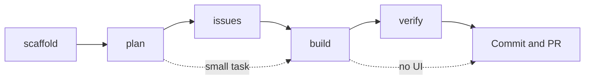

# Claude Code

Claude Code is the primary development tool. It reads the codebase, writes code, runs tests, and handles git operations.

## Aliases

```bash
cc      # claude (start session)
ccc     # claude chat (conversational mode)
ccr     # claude --resume (continue previous session)
cci     # claude init (initialize project config)
ccv     # claude --verbose
```

## Configuration

Claude Code reads config from `~/.claude/`, which is symlinked from the dotfiles:

```
~/.claude/
├── CLAUDE.md              # Global preferences (stack, workflow, conventions)
└── docs/                  # Reference docs loaded via project CLAUDE.md
```

The global `CLAUDE.md` is intentionally lean. Per [context engineering best practices](https://www.humanlayer.dev/blog/writing-a-good-claude-md), fewer instructions means better instruction-following. The workflow phases are documented in CLAUDE.md as a mental model, not as executable commands.

## Developer Workflow



1. **Scaffold** — Generate a new SvelteKit PWA + Cloudflare project (skip for existing projects)
2. **Plan** — Research the codebase, evaluate Svelte 5 / Workers / PWA constraints, draft design doc
3. **Issues** — Break the plan into sized, ordered GitHub issues with dependency links
4. **Build** — Layered TDD: unit tests (vitest) → component tests (testing-library) → E2E (playwright/browser)
5. **Verify** — Open in Chrome (`claude --chrome`), visually verify, check console, test interactions
6. **Commit** — Conventional commits, PR via `gh pr create`

For small tasks, skip straight to Build. For non-UI changes, skip Verify. The workflow is composable, not rigid.

## Browser Feedback Loop

Enable Chrome access for visual UI verification:

```bash
claude --chrome          # Launch with Chrome integration
# Or inside a session: /chrome → "Enabled by default"
```

This lets Claude see the actual rendered UI, check console errors, test interactions, and verify responsive behavior autonomously. Add this to your project CLAUDE.md:

```markdown
After making any frontend changes, visually verify in Chrome before reporting completion.
```

## Testing Layers

| Layer | Tool | What it tests |
|-------|------|---------------|
| Unit | vitest | Stores, utils, API handlers |
| Component | testing-library/svelte | Render, interaction, reactive state |
| E2E | playwright or Chrome | User flows, navigation, offline |

The Build phase drives all three layers in sequence.

## Project Setup

Each project gets its own `CLAUDE.md` at the root. Use the template:

```bash
cp ~/.dotfiles/claude/project-CLAUDE.md.example ./CLAUDE.md
```

A good project CLAUDE.md covers the **WHAT** (structure, stack), **WHY** (purpose), and **HOW** (build, test, deploy). Keep it under 80 lines. Use progressive disclosure — point to docs instead of inlining content.

## PKM Integration

For persistent knowledge across projects, use a private Obsidian vault with Claude agents. See [14-claude-pkm.md](14-claude-pkm.md) for setup.

## Multi-Agent Patterns

For larger tasks, Claude Code orchestrates sub-agents automatically:
- One agent researches the codebase
- Another writes implementation
- Another writes tests

This happens via the `Task` tool when complexity warrants it.

## Debugging

```bash
cc
# "The D1 query in src/routes/users.ts is returning empty results.
#  The table schema is in migrations/0001_users.sql. Debug this."
```

Claude will read the relevant files, trace the issue, and propose a fix.
