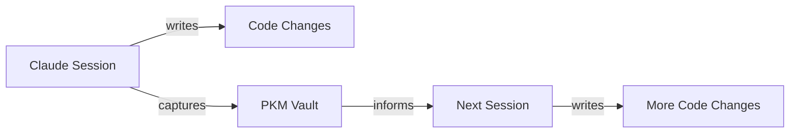

# Claude PKM (Personal Knowledge Management)

A private Obsidian vault for project knowledge that persists across Claude Code sessions.

## Why a Separate Vault

Dotfiles are public config -- they define *how* you work. PKM is private knowledge -- it captures *what* you've learned, decided, and planned across projects. These live in separate repos:

- **Dotfiles** (`~/.dotfiles`) — Shell config, editor setup, global CLAUDE.md
- **PKM vault** (`~/vault` or similar) — Project notes, decision logs, session summaries, goals

The PKM vault is gitignored from project repos but version-controlled in its own private repo.

## Getting Started

Use [obsidian-claude-pkm](https://github.com/ballred/obsidian-claude-pkm) as a starting template:

```bash
# Clone the template into your vault location
gh repo create my-pkm --private --clone
cd my-pkm

# Copy the template structure
gh repo clone ballred/obsidian-claude-pkm /tmp/pkm-template
cp -r /tmp/pkm-template/.claude /tmp/pkm-template/Templates .
rm -rf /tmp/pkm-template
```

The template provides:
- `.claude/agents/` — Custom agents for note organization, weekly reviews, goal alignment
- `.claude/skills/` — Slash commands (`/daily`, `/weekly`, `/push`, `/onboard`)
- `.claude/hooks/` — Auto-commit on session end, session initialization
- `Templates/` — Daily notes, project kickoff, decision log templates

## Vault Structure

Adapt to your needs, but the template suggests:

```
vault/
├── CLAUDE.md              # Vault-specific agent context
├── .claude/               # Agents, skills, hooks for the vault
├── Daily Notes/           # Daily logs (auto-created via /daily)
├── Goals/                 # 3-year → quarterly → weekly cascading goals
├── Projects/              # Per-project knowledge (decisions, learnings)
├── Templates/             # Note templates
└── Archives/              # Completed projects, old notes
```

## How It Connects to Development

When working on a project, your Claude Code sessions draw from three layers:

1. **Global** (`~/.claude/CLAUDE.md`) — Your universal preferences and workflow commands
2. **Project** (project root `CLAUDE.md`) — Build commands, architecture, testing strategy
3. **PKM** (vault notes) — Decisions you've made, context from past sessions, goals

The PKM vault is *not* automatically loaded into Claude sessions. Reference it when needed:
- Start a session with "read my notes on X from the vault"
- Use the vault's `/weekly` command for reviews
- Store session summaries after completing significant work

## Session Knowledge Flow



Key habit: after completing a meaningful chunk of work, summarize decisions and learnings into the vault so future sessions have context.

## What to Capture in PKM

- **Decision logs** — Why you chose approach A over B
- **Architecture notes** — How systems connect, with Mermaid diagrams
- **Session summaries** — What was accomplished, what's next
- **Patterns learned** — Reusable solutions discovered during implementation
- **Project status** — Current state, blockers, next milestones
