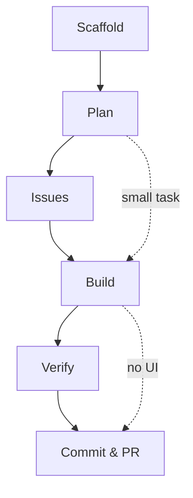

# Dev Home

> One page to rule them all. Open this vault in Obsidian or read the markdown directly.

## Quick Start

New machine? See [[15-quickstart|Quickstart Guide]] for install, post-install checklist, and day-one commands.

```bash
git clone https://github.com/jamesfdavis/dotfiles.git ~/dotfiles
cd ~/dotfiles && ./install.sh
```

## Developer Workflow

The agent writes the code, you steer. Everything runs in the terminal.



| Phase | What happens |
|-------|--------------|
| Scaffold | Generate a new SvelteKit PWA + Cloudflare project |
| Plan | Research codebase, draft stack-aware design, get approval |
| Issues | Break plan into sized, ordered GitHub issues |
| Build | Layered TDD: unit (vitest) -> component (testing-library) -> E2E (playwright) |
| Verify | Browser-based UI verification via `claude --chrome` |
| Ship | Conventional commit, open PR via `gh pr create` |

Skip steps when appropriate -- existing project? skip Scaffold. Small fix? straight to Build. No UI? skip Verify.

## Vault Index

Every tool in the stack has a dedicated reference doc.

- [[00-stack|The Stack]] — Full stack overview and principles
- [[01-ghostty-starship|Ghostty + Starship]] — Terminal config, keybindings, prompt
- [[02-claude-code|Claude Code]] — Agent workflow, aliases, browser loop
- [[03-cloudflare|Cloudflare]] — Workers, D1, KV, R2, Wrangler aliases
- [[04-docker|Docker]] — Colima, Docker Compose, cleanup
- [[05-git-workflow|Git Workflow]] — Aliases, commit signing, branch strategy
- [[06-python-uv|Python + uv]] — Fast venvs, pip installs, Jupyter
- [[07-neovim|Neovim]] — Keybindings, motions, Telescope, LSP, plugins
- [[08-fzf-ripgrep-fd|FZF + ripgrep + fd]] — Fuzzy finding, code search, file discovery
- [[09-cli-utilities|CLI Utilities]] — bat, eza, zoxide, jq
- [[10-node-nvm|Node + NVM]] — Lazy loading, .nvmrc auto-switch, npm aliases
- [[11-lazygit|Lazygit]] — TUI for staging, rebasing, conflict resolution
- [[12-github-cli|GitHub CLI]] — PRs, issues, API calls, completions
- [[13-zsh-shell|Zsh Shell]] — Plugins, history, functions, shell options
- [[14-claude-pkm|Claude PKM]] — Private Obsidian vault for persistent knowledge
- [[15-quickstart|Quickstart]] — Install, post-install checklist, day-one commands
- [[16-devcontainer|Devcontainer + OrbStack]] — Sandboxed Claude Code on macOS with network firewall

## External Docs

Official documentation for the core stack.

### Frontend & Framework

| Tool | Docs |
|------|------|
| SvelteKit | [kit.svelte.dev/docs](https://kit.svelte.dev/docs) |
| Svelte 5 (Runes) | [svelte.dev/docs/svelte](https://svelte.dev/docs/svelte) |
| Tailwind CSS v4 | [tailwindcss.com/docs](https://tailwindcss.com/docs) |
| Vite | [vite.dev/guide](https://vite.dev/guide/) |
| vite-plugin-pwa | [vite-pwa-org.netlify.app/guide](https://vite-pwa-org.netlify.app/guide/) |

### Platform & Deploy

| Tool | Docs |
|------|------|
| Cloudflare Workers | [developers.cloudflare.com/workers](https://developers.cloudflare.com/workers/) |
| Cloudflare D1 | [developers.cloudflare.com/d1](https://developers.cloudflare.com/d1/) |
| Cloudflare KV | [developers.cloudflare.com/kv](https://developers.cloudflare.com/kv/) |
| Cloudflare R2 | [developers.cloudflare.com/r2](https://developers.cloudflare.com/r2/) |
| Cloudflare Pages | [developers.cloudflare.com/pages](https://developers.cloudflare.com/pages/) |
| Wrangler CLI | [developers.cloudflare.com/workers/wrangler](https://developers.cloudflare.com/workers/wrangler/) |

### Testing

| Tool | Docs |
|------|------|
| Vitest | [vitest.dev/guide](https://vitest.dev/guide/) |
| Testing Library (Svelte) | [testing-library.com/docs/svelte-testing-library/intro](https://testing-library.com/docs/svelte-testing-library/intro/) |
| Playwright | [playwright.dev/docs/intro](https://playwright.dev/docs/intro) |

### AI & Agent

| Tool | Docs |
|------|------|
| Claude Code | [docs.anthropic.com/en/docs/claude-code](https://docs.anthropic.com/en/docs/claude-code/) |
| Claude Code CLI | [docs.anthropic.com/en/docs/claude-code/cli-usage](https://docs.anthropic.com/en/docs/claude-code/cli-usage) |

### Dev Tools

| Tool | Docs |
|------|------|
| Ghostty | [ghostty.org/docs](https://ghostty.org/docs) |
| Neovim | [neovim.io/doc](https://neovim.io/doc/) |
| Starship | [starship.rs/config](https://starship.rs/config/) |
| ripgrep | [github.com/BurntSushi/ripgrep/blob/master/GUIDE.md](https://github.com/BurntSushi/ripgrep/blob/master/GUIDE.md) |
| fd | [github.com/sharkdp/fd#how-to-use](https://github.com/sharkdp/fd#how-to-use) |
| fzf | [github.com/junegunn/fzf#usage](https://github.com/junegunn/fzf#usage) |
| bat | [github.com/sharkdp/bat#how-to-use](https://github.com/sharkdp/bat#how-to-use) |
| eza | [github.com/eza-community/eza#usage](https://github.com/eza-community/eza#usage) |
| zoxide | [github.com/ajeetdsouza/zoxide#usage](https://github.com/ajeetdsouza/zoxide#usage) |
| lazygit | [github.com/jesseduffield/lazygit#usage](https://github.com/jesseduffield/lazygit#usage) |
| GitHub CLI | [cli.github.com/manual](https://cli.github.com/manual/) |

### Languages & Runtimes

| Tool | Docs |
|------|------|
| Node.js | [nodejs.org/docs/latest/api](https://nodejs.org/docs/latest/api/) |
| NVM | [github.com/nvm-sh/nvm#usage](https://github.com/nvm-sh/nvm#usage) |
| Python | [docs.python.org/3](https://docs.python.org/3/) |
| uv | [docs.astral.sh/uv](https://docs.astral.sh/uv/) |

### Containers

| Tool | Docs |
|------|------|
| Docker Compose | [docs.docker.com/compose](https://docs.docker.com/compose/) |
| Colima | [github.com/abiosoft/colima#usage](https://github.com/abiosoft/colima#usage) |

## Key Aliases

```bash
# Claude Code
cc / ccc / ccr / cci        # claude / chat / resume / init

# Cloudflare
wr / wrd / wrp / wrl        # wrangler / dev / deploy / tail

# Git
lg                          # lazygit
gs / ga / gcm / gp / gl     # status / add / commit / push / pull

# Navigation
z <dir>                     # smart directory jump (zoxide)

# Editors
v / c / c.                  # nvim / code / code .
```

Full alias list: `~/.aliases` or run `alias` in any shell.

## Maintenance

```bash
brewup                      # update all Homebrew packages
cd ~/dotfiles && git pull   # symlinks update instantly
```
